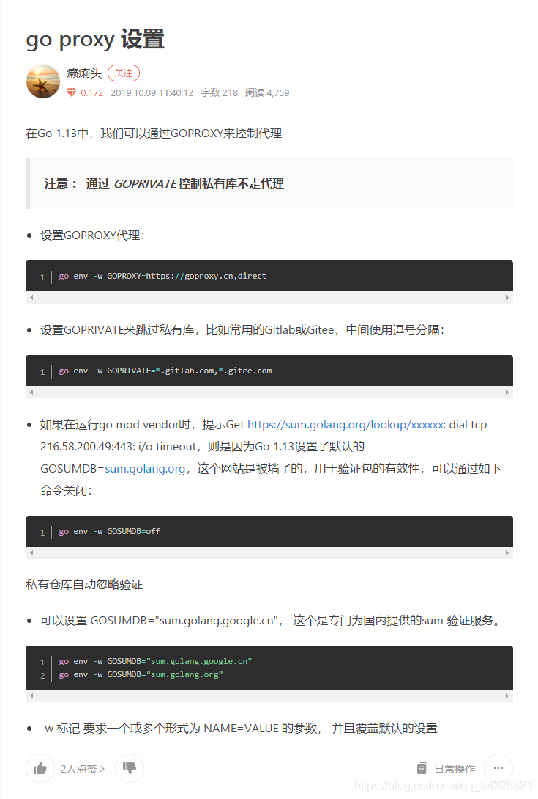

这边使用到的是gopsUtil：[gopsutil](https://github.com/shirou/gopsutil)

获取对应的github代码命令：go get -u https://github.com/shirou/gopsutil

在获取包的时候会发生Sum.goland.org校验但是连接不上的问题，解决方案可以参考：[Go工程下载包 Sum.goland.org无法连通问题](https://blog.csdn.net/qq_34326321/article/details/111207006)

